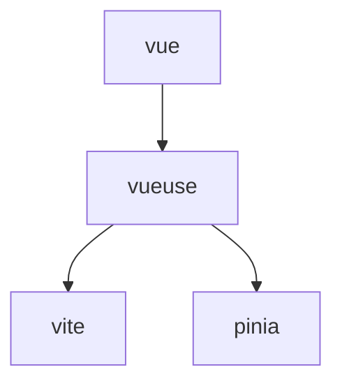

# VueUse

## Что это + когда брать

Коллекция composables для Vue. Берём, когда нужно быстро закрывать типичные задачи: реактивные утилиты, интеграции с API браузера и удобные хелперы.

## Топ composables (коротко)

- `useMouse` / `useWindowSize` — базовые данные UI.
- `useFetch` — простой слой над fetch.
- `useLocalStorage` — состояние в storage.
- `useIntersectionObserver` — видимость элементов.

## С чем обычно вместе

- [Vue](/frontend/foundation/vue)
- [Vite](/frontend/foundation/vite)

## Альтернативы

- Самописные composables под проект.

## Материалы

- Документация VueUse.
- Подборки лучших composables.

